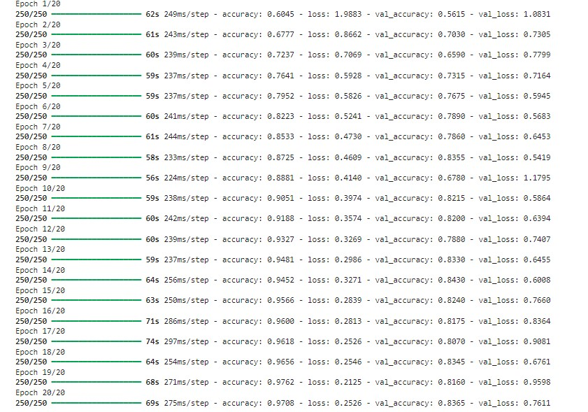
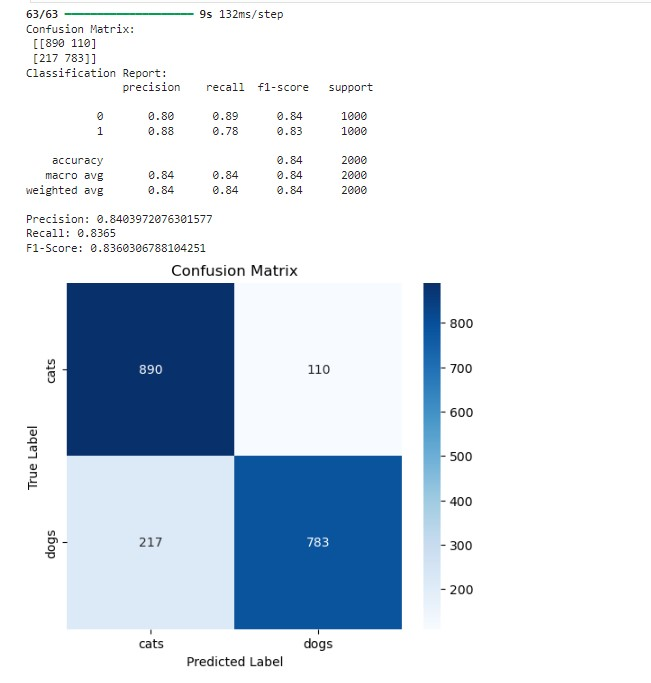
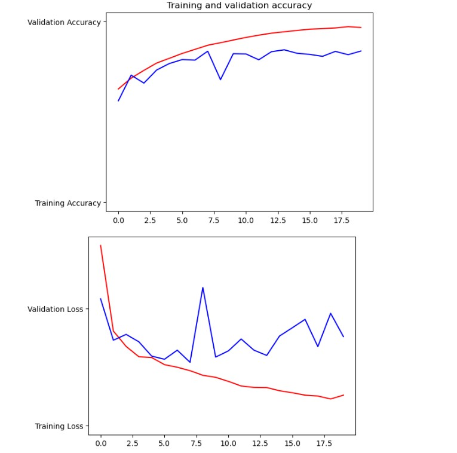
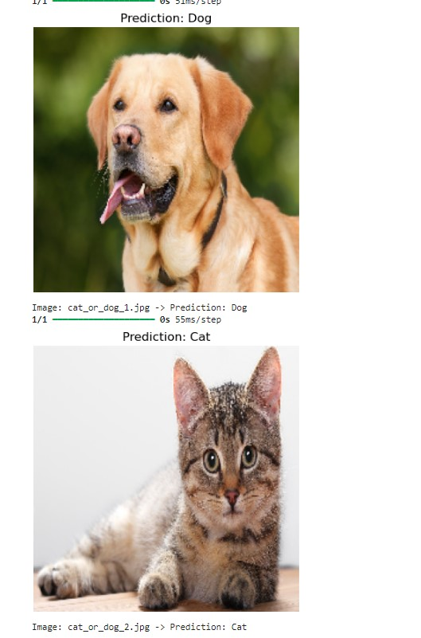

# CNN Image Classification Project

## Project Overview
This project demonstrates the implementation of a Convolutional Neural Network (CNN) for image classification. Using Python and deep learning frameworks like TensorFlow/Keras, the model is trained to classify images of cats and dogs. The primary focus of this project is to explore CNN architectures, preprocess datasets effectively, and evaluate the model's performance.

## Dataset
The dataset used for this project consists of **2000 labeled images** split evenly between two categories:

- **Cats:** 1000 images
- **Dogs:** 1000 images

All images were resized to **64x64 pixels** for uniformity. The data was divided into **training** and **validation** subsets. You can download the dataset from this [link](https://drive.google.com/drive/folders/1iDuB2VXfgXM352kK8GWH5PGSHIEmfP9U?usp=drive_link).

## Model Architecture
The CNN architecture comprises the following layers:

1. **Convolutional Layers**: Feature extraction from input images.
2. **Batch Normalization**: Applied to stabilize and accelerate training.
3. **Max Pooling Layers**: Downsampling the spatial dimensions of feature maps.
4. **Dropout Layers**: Preventing overfitting by randomly disabling neurons during training.
5. **Fully Connected Layers**: Making predictions based on extracted features.

### Layer-wise Details
| Layer (type)               | Output Shape       | Param #    |
|----------------------------|--------------------|------------|
| Dropout (Dropout)          | (None, 64, 64, 3)  | 0          |
| Conv2D (Conv2D)            | (None, 64, 64, 32) | 896        |
| BatchNormalization         | (None, 64, 64, 32) | 128        |
| MaxPooling2D               | (None, 32, 32, 32) | 0          |
| Conv2D (Conv2D)            | (None, 32, 32, 64) | 18,496     |
| BatchNormalization         | (None, 32, 32, 64) | 256        |
| MaxPooling2D               | (None, 16, 16, 64) | 0          |
| Conv2D (Conv2D)            | (None, 16, 16, 128)| 73,856     |
| BatchNormalization         | (None, 16, 16, 128)| 512        |
| MaxPooling2D               | (None, 8, 8, 128)  | 0          |
| Conv2D (Conv2D)            | (None, 8, 8, 256)  | 295,168    |
| BatchNormalization         | (None, 8, 8, 256)  | 1024       |
| MaxPooling2D               | (None, 4, 4, 256)  | 0          |
| Flatten                    | (None, 4096)       | 0          |
| Dense (Dense)              | (None, 128)        | 524,416    |
| Dropout                    | (None, 128)        | 0          |
| Dense (Dense)              | (None, 1)          | 129        |

Total Trainable Parameters: **915,881**

## Results
The model achieved the following performance metrics on the test set:

- **Accuracy**: 97.08% (with 20 epochs)
- **Precision**: 0.84
- **Recall**: 0.8365
- **F1-Score**: 0.8360

### Confusion Matrix
|              | Predicted: Cats | Predicted: Dogs |
|--------------|-----------------|-----------------|
| **Actual: Cats** | 890             | 110             |
| **Actual: Dogs** | 217             | 783             |

### Classification Report
| Class | Precision | Recall | F1-Score | Support |
|-------|-----------|--------|----------|---------|
| Cats  | 0.80      | 0.89   | 0.84     | 1000    |
| Dogs  | 0.88      | 0.78   | 0.83     | 1000    |
## Visualizations

### 1. Accuracy

### 2. Confusion Matrix

### 3. Training Accuracy vs Validation Accuracy

### 4. Sample Predictions

*Above: Visualizations including the accuracy, confusion matrix, accuracy/loss plots, and sample model predictions.*

## Key Features
- **Batch Normalization**: Enhanced training stability and reduced sensitivity to initialization.
- **Dropout**: Prevented overfitting in fully connected layers.
- **Multi-layer CNN**: Four convolutional blocks for robust feature extraction.

## Future Work
- Incorporate **Transfer Learning** to further improve model accuracy.
- Test the model on a larger and more diverse dataset.
- Deploy the model as a web application for real-world use cases.

## Medium Post
Read the detailed methodology and insights on my Medium post: [https://medium.com/@anmradwan88/cnn-for-image-classification-dog-vs-cat-3e11dbb4a85d]

---
